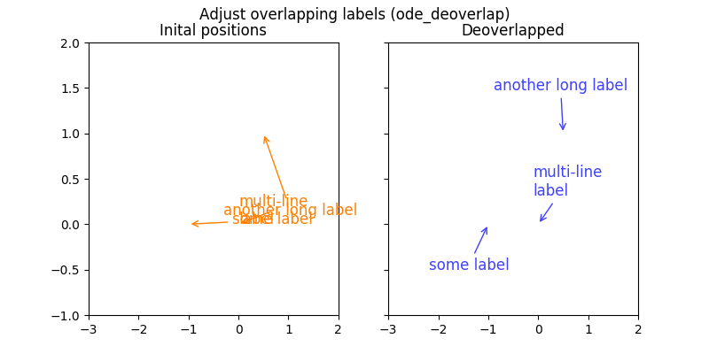

# MPL\_AnnoDeoverlap2D
Aim to adjust (matplotlib) annotation text objects to minimize overlapping in 2-D plot.


# Dependencies

* Python >= 3.3.0
* Numpy >= 1.14.0
* boost::numeric::odeint
* C++11 compatible C++ compiler (tested with G++/Clang++)
* GNU make


# Build

```bash
make all PYTHON_INCLUDE="-I..." NUMPY_INCLUDE="-I..." BOOST_INCLUDE="-I..." PYTHON_LIB="-L... -l..."
```

`PYTHON_INCLUDE` is the directory containing Python.h. By default check `/usr/include/python?.?`;

`PYTHON_LIB` is required when native python is built with a shared library. If not, this argument can be ignored.
Example: `PYTHON_LIB=-L/usr/lib/python?.?/ -lpython?.?`

`NUMPY_INCLUDE` is the include directory to numpy headers (numpy/\*.h).
Usually the default path is `/usr/local/lib/python?.?/dist-packages/numpy/core/include`

`BOOST_INCLUDE` this package relies on ODE solver provided by boost C++.
`boost::numeric::odeint` does not require extra link directives.


# Install

Just copy everything in `deoverlap_2d` to a library path that python interpreter can find.
Make sure the compiled binary module `_deoverlap_croutines.so` is copied alongside
(it should present in `deoverlap_2d/` by calling `make all`)

```bash
cp -r deoverlap_2d /python.library.path/
```


# Minimal example (deoverlap\_2d.ode\_deoverlap)

```python
#!/usr/bin/env python3

from matplotlib import pyplot
from deoverlap_2d import get_text_dimensions, ode_deoverlap

# texts
texts = ["some label", "another long label", "multi-line\nlabel"]
# initial text positions
init_xys = [(-0.12345, 0), (-0.3, 0.1), (0, 0)]
# annotation points of each text
anno_xys = [(-1, 0), (0.5, 1.0), (0, 0)]

figure, axes = pyplot.subplots(nrows = 1, ncols = 2, figsize = (8, 4),
	sharex = True, sharey = True)
axes[0].set_xlim(-3, 2)
axes[0].set_ylim(-1, 2)
text_dims = get_text_dimensions(axes[0], texts, fontsize = 12)

# adjust labels
deoverlap_xys = ode_deoverlap(init_xys, text_dims,
	anno_xys = anno_xys, clip_box = [-3.0, 2.0, -1.0, 2.0],
	text_repel_force = 1.0, anno_repel_force = 1.0, anno_attract_force = 0.2)

# show on matplotlib
for s, a_xy, before_xy, after_xy in zip(texts, anno_xys, init_xys, deoverlap_xys):
	axes[0].annotate(s, a_xy, before_xy, fontsize = 12, color = "#FF8000",
		arrowprops = {"arrowstyle": "->", "edgecolor": "#FF8000"})
	axes[1].annotate(s, a_xy, after_xy, fontsize = 12, color = "#4040FF",
		arrowprops = {"arrowstyle": "->", "edgecolor": "#4040FF"})
axes[0].set_title("Inital positions")
axes[1].set_title("Deoverlapped")
figure.suptitle("Adjust overlapping labels (ode_deoverlap)")
pyplot.show()
pyplot.close()
```

Result:


